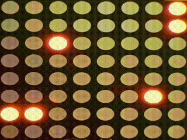
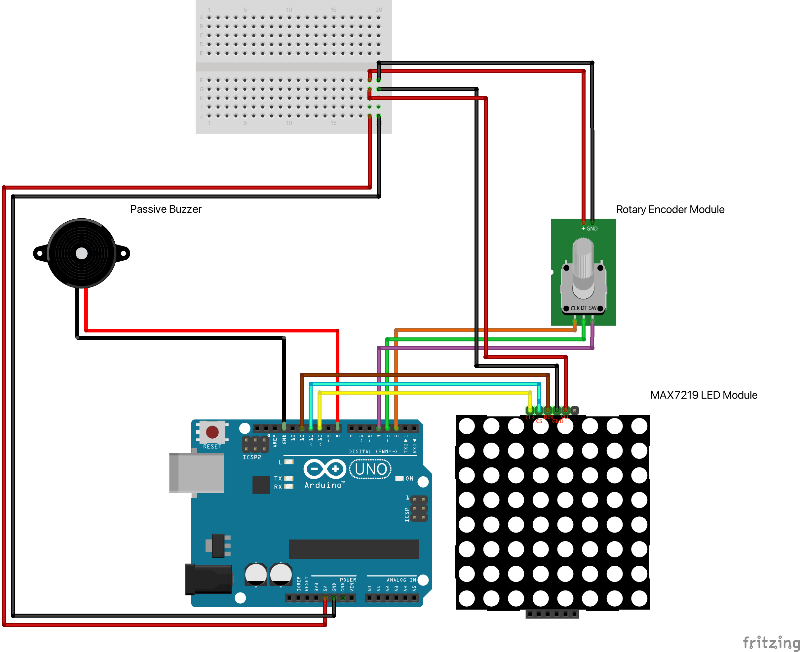
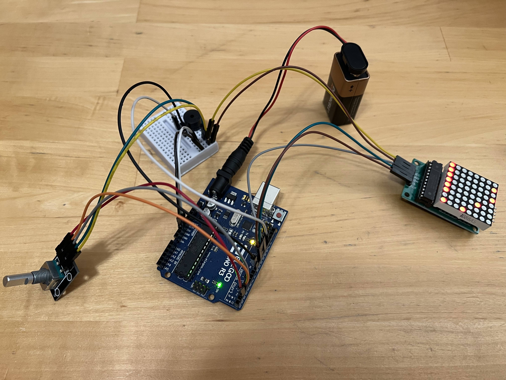

# Igrica pik (tiny game of dots)

This is a tiny game of dots for Arduino. Goal is to turn the rotary button until you reach the enemy, then push button to eliminate it. Reaching the center of spiral wins the game but crossing paths with enemy restarts it.

## List of components

- Arduino UNO R3 (or compatible board)
- Tiny breadboard
- MAX7219 LED Module
- Rotary Encoder Module
- Passive Buzzer
- 10x plug-socket jumper wires
- 4x plug-plug jumper wires

## Wiring diagram

Source [Firtzing](https://fritzing.org) file for this wiring diagram can be found in `docs/wiring-diagram.fzz`.

## Assembled project

